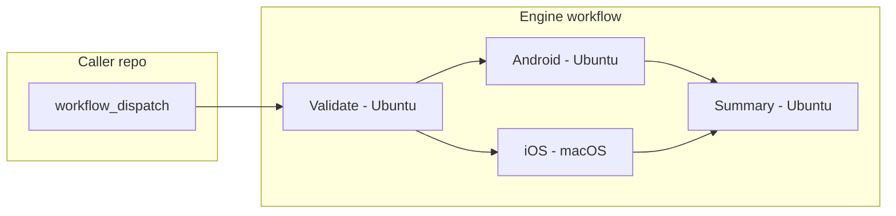

# Architecture

High-level design of the Mobile CI Engine: flow, jobs, caching, signing, and guarantees.

## Overview

The engine is a **single reusable workflow** (`mobile-build.yml`) that is invoked only via `workflow_call`. Caller repositories add a thin workflow that uses `workflow_dispatch` and call this workflow with inputs and `secrets: inherit`. The engine never runs on push or pull_request; it is **manual dispatch only**.

**Goal:** Replace EAS Build by building Android and iOS apps on GitHub Actions, with no dependency on Expo’s build servers. Expo projects are supported via **local prebuild** (e.g. `expo prebuild`) then standard Gradle and Xcode builds.

## Flow



1. User triggers the **caller** workflow (e.g. "Build Mobile") via the Actions tab.
2. The caller workflow runs and calls the **engine** workflow with inputs and secrets.
3. **Validate** (Ubuntu): Checks inputs, detects project type (React Native / Expo / native), and verifies that required secrets exist for the requested platform and environment. Fails fast so macOS is not used if iOS is misconfigured.
4. **Android** (Ubuntu) and **iOS** (macOS) run in parallel when allowed by `platform`. Each: checkout, restore caches, install deps, optional Expo prebuild, optional version bump, signing setup (production), build, checksum, upload artifacts, cleanup (remove keystore/keychain).
5. **Summary** (Ubuntu): Runs after Android and iOS (with `if: always()` so it runs even when a build job fails). Produces a structured markdown summary (platform, environment, commit, status, artifact checksums) and writes it to the job summary and workflow output.

Android never runs on macOS; iOS is the only job that uses macOS, to minimize cost.

## Caching

- **Node:** Key includes hash of lockfiles (`package-lock.json`, `yarn.lock`, `pnpm-lock.yaml`). Path: `node_modules`. Package manager is detected (npm, yarn, or pnpm); pnpm is installed automatically via `pnpm/action-setup@v4` when `pnpm-lock.yaml` is present. If no lockfile exists, cache is skipped and a warning is logged.
- **Gradle:** Key includes hash of Gradle wrapper and build files. Paths: `~/.gradle/caches`, `~/.gradle/wrapper`.
- **CocoaPods:** Key includes hash of `ios/Podfile.lock`. Paths: `ios/Pods`, `~/Library/Caches/CocoaPods`.

- **DerivedData:** Key includes hash of Xcode project/workspace files. Path: `~/Library/Developer/Xcode/DerivedData`. Speeds up incremental iOS builds.

All caches use `actions/cache@v4`. No static keys; keys are derived from project state so cache invalidation is automatic when deps or config change.

If a `Gemfile` is detected (repo root or `ios/`), the workflow uses `bundle exec pod install` to respect the pinned CocoaPods version.

## Signing

- **Android (production):** The workflow decodes `ANDROID_KEYSTORE_BASE64` to a temporary file, sets signing-related env vars (passwords, alias) for Gradle, builds, then deletes the temp file in an `if: always()` step. The caller’s `build.gradle` (or signing config) must use these env vars; the engine does not modify your project files.
- **Android (staging):** No signing secrets are injected. The build uses whatever signing config is in your project's `build.gradle` (typically the debug keystore if no release signing config is defined).
- **iOS:** The workflow creates a temporary keychain, imports the cert (from `IOS_CERT_BASE64`) and provisioning profile (from `IOS_PROFILE_BASE64`), runs the build and export, then deletes the keychain and temp files in an `if: always()` step.

Secrets are never echoed or logged. They are provided by the caller and passed through `secrets: inherit` (or explicit mapping). The engine repo stores no secrets.

## Expo path (no EAS Build)

For projects detected as Expo (e.g. `expo` in `package.json`), the build jobs run **`expo prebuild`** (or `npx expo prebuild`) to generate or refresh `android/` and `ios/` on the runner. The rest of the pipeline is the same as for React Native or native: Gradle for Android, Xcode for iOS. The engine does **not** call EAS Build or EAS CLI; it replaces EAS Build with local builds on GitHub-hosted runners.

## Concurrency

The workflow sets:

```yaml
concurrency:
  group: mobile-ci-${{ github.workflow }}-${{ github.ref }}
  cancel-in-progress: true
```

So a new run on the same branch cancels any in-progress run of the same workflow, reducing wasted minutes.

## Guarantees

- **Stateless:** No persistent state in the engine repo; each run uses caller repo + caller secrets + caches.
- **No org dependency:** Works for any public or private caller repo; no organization-level secrets or settings are required.
- **Versioned:** Callers should use a tag (e.g. `@v1`); the engine documents and uses semantic versioning and a changelog.
- **Fail early:** Validate runs first and checks inputs and secrets; Android and iOS only run if validation passes (and if `platform` allows).
